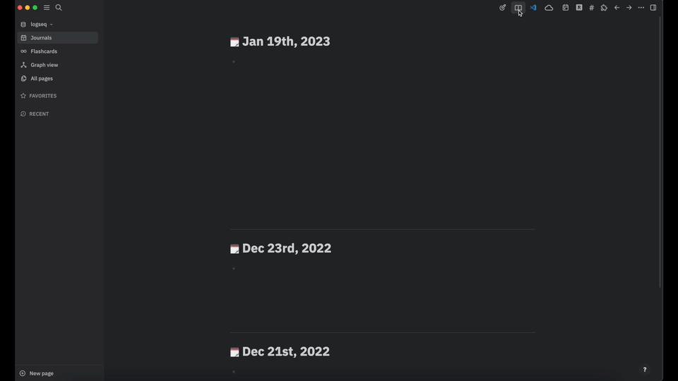

# Logseq Kindle Import

A plugin that lets you import your kindle highlights which have been created on your kindle, kindle app on mobile or other devices.

## Why?

If you are reading a lot of books and use kindle as your daily reading driver, you will create a lot of highlights which could be used and connected in your logseq knowledge database.
To save the manuel transfer of your kindle highlights the plugin provides a way to automatically import as html file exported kindle higlights.

## How to use?

1. Go to your kindle app (e.g. mac or iphone), select a book whose highlights you'd like to export and export/share them.
2. Export your highlights by email - The kindle app creates a **.html file** that contains all your highlights from that selected book (exported markdown files won't work with the plugin).
3. Open logseq > logseq kindle import plugin and choose the exported html file
4. The plugin will create a new logseq page and imports all highlights listed in the html file

## Demo

## Planned work

- see the [open issues](https://github.com/nicdun/logseq-kindle-import/issues)
